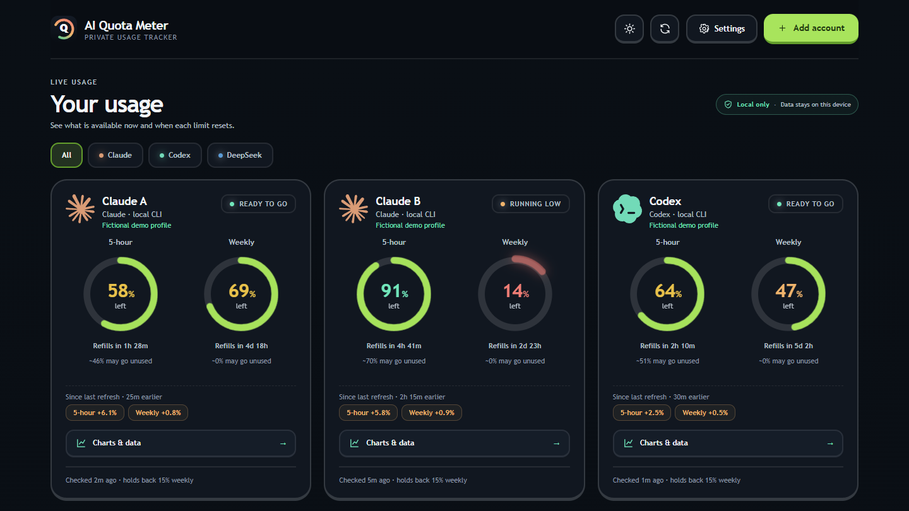

<p align="center">
  
</p>

<h1 align="center">AI Quota Meter</h1>

<p align="center">
  <strong>Your AI accounts. One clear view.</strong><br>
  Track Claude and Codex limits, DeepSeek credits, and usage history, all in one dashboard.<br>
  Open source. Local first. Built for your daily workflow.
</p>

<p align="center">
  <a href="LICENSE"></a>
  <a href="#download"></a>
  <a href="#quick-start"></a>
</p>

<p align="center">
  <a href="https://github.com/vibezentura/ai-quota-meter/releases/latest"><strong>Download</strong></a> ·
  <a href="#preview">Preview</a> ·
  <a href="#quick-start">Quick start</a> ·
  <a href="#add-accounts">Add accounts</a> ·
  <a href="SECURITY.md">Security</a> ·
  <a href="#development">Development</a>
</p>

<details>
<summary><strong>Explore the documentation</strong></summary>

[Download](#download) · [Updates](#update-an-existing-installation) · [Quick start](#quick-start) · [Accounts](#add-accounts) · [Usage history](#refresh-ledger) · [Privacy](#encrypted-local-vault) · [Deployment](#public-deployment-modes) · [Development](#development) · [Roadmap](#roadmap)

</details>

## Overview

AI Quota Meter brings subscription limits and API credits into one private dashboard. Circular energy meters, reset countdowns, and plain-language statuses make current usage easy to scan.

### Supported providers

| Provider | What you can track | How it connects |
| --- | --- | --- |
| **Claude** | Five-hour and weekly subscription windows | Your local Claude Code login or a separate sign-in profile |
| **Codex** | Subscription rate-limit windows | Your local Codex App Server login or a separate sign-in profile |
| **DeepSeek** | Live API credits, plus imported token and request totals | API key through the local connector; optional usage CSV |

### Dashboard features

| Feature | What it helps you do |
| --- | --- |
| **Refresh ledger** | See usage between checks, burn rate, and estimated time to limit. |
| **Charts and exports** | Explore usage over time, inspect session history, and export CSV. |
| **Private profiles** | Keep separate logins, nicknames, and colors in an encrypted local vault. |
| **Personal display** | Switch light/dark themes, hide email identities, and recognize accounts by their colored provider icons. |
| **Demo mode** | Explore the dashboard with fictional accounts before connecting anything. |

Provider filters, capacity forecasts, and the reset timeline share the same dashboard. Selecting a provider filters the whole page.

## Preview

<p align="center">
  <picture>
    <source media="(prefers-color-scheme: dark)" srcset="docs/assets/dashboard-dark.png">
    <source media="(prefers-color-scheme: light)" srcset="docs/assets/dashboard-light.png">
    
  </picture>
</p>

<p align="center"><em>Actual app screenshots with fictional demo accounts. The preview follows your light or dark theme.</em></p>

## Download

**Windows builds require no separate Node.js installation.**

Grab a build from the [latest release](https://github.com/vibezentura/ai-quota-meter/releases/latest):

| Edition | Download filename | Experience |
| --- | --- | --- |
| **Desktop · recommended** | `ai-quota-meter-desktop-setup-<version>.exe` | Native window, tray icon, and an installer. [Desktop guide](desktop/README.md) |
| **Browser installer** | `ai-quota-meter-setup-<version>.exe` | Default browser, Start Menu shortcut, optional desktop shortcut, and Windows uninstall support. |
| **Portable** | `ai-quota-meter.exe` | Run directly with no installation; opens in your default browser. |

The browser installer installs per user by default, without administrator rights.

The two browser-based builds start their console window minimized when launched from a Start Menu or desktop shortcut; closing it stops the app.

> [!NOTE]
> All three builds are **unsigned**. Windows SmartScreen will show "Windows protected your PC" — select **More info**, then **Run anyway**. Each release includes a `SHA256SUMS.txt` if you want to verify a download first.

### Update an existing installation

To update, download and run the newer installer for the **same edition** you already use. The desktop installer shows the installed and incoming versions and selects **Update** by default. The browser-based installer shows **Update** on its welcome and confirmation pages and keeps the existing installation folder. Updating keeps your saved accounts, settings, and usage history; no manual uninstall is needed. Running the same version offers **Reinstall** instead. Close the app before updating (desktop: tray → **Quit**). The desktop and browser-based editions are separate installations; installing one does not update the other.

## Quick start

Requirements: **Node.js 20 or newer**. From the repository root:

```bash
npm start
```

Open <http://127.0.0.1:4173>.

Running the local server is the full-trust mode. It enables the loopback-only DeepSeek connector. The server does not need a database and does not persist API keys.

### Build a Windows executable

Building the single-file executable yourself: `npm run build:exe` produces `dist/ai-quota-meter.exe` (same unsigned caveat as above). Building the installer additionally needs [Inno Setup](https://jrsoftware.org/isinfo.php): `iscc installer\ai-quota-meter.iss /DMyAppVersion=<version>`.

### Offline use and demo mode

You can also double-click `index.html` for the offline-only interface. Account setup, the encrypted vault, demos, and local imports work there; live DeepSeek balance checks require `npm start` because API keys are intentionally accepted only by the loopback companion.

To open the fictional dashboard immediately:

```text
http://127.0.0.1:4173/?demo=1
```

## Add accounts

1. Select **Add account**.
2. Create a master passphrase of at least 12 characters. It is not stored and cannot be recovered.
3. Select Claude, Codex, or DeepSeek.
4. For Claude/Codex, choose **the one I'm already signed in to** (uses the login already on this computer — nothing to type) or **a different account** to add a second one.
5. For DeepSeek, enter an API key and select **Test connection and save**.

### Sign-in and separate profiles

Picking "a different account" opens a sign-in window itself — no command to copy, no choosing between PowerShell/cmd/terminal. Finish the provider's own sign-in steps in that window and this page picks it up on its own within a few seconds; there's no second button to come back and press. If a terminal can't be opened for you (a headless machine, an unusual desktop), a **Run the command myself instead** link falls back to a copyable command for the shell you actually use, and the page still detects completion automatically either way.

A private nickname is optional — leave it blank and the verified account identity is used. Weekly reserve lives under **Advanced** in the add-account dialog: how much of the weekly limit to hold back before AI Quota Meter stops suggesting that account and points at another one instead.

### DeepSeek credits and CSV imports

The app calls the official `GET /user/balance` endpoint and displays each returned currency's total, granted, and topped-up balance. DeepSeek does not currently document an API for historical usage by key; its official FAQ directs users to export monthly usage CSVs from the platform. Select the optional `amount-*.csv` file during setup—or **Import usage** later—to calculate request and token totals per API-key label entirely in the browser. Raw CSV rows are not retained; only the aggregate is encrypted into the local vault.

### Refresh subscription limits

Claude and Codex subscription windows both refresh on demand—select the refresh icon on a card, **Check my accounts** in the hero, or the refresh icon in the header:

- Claude: reads the signed-in identity from the local Claude Code CLI, then reads the 5-hour and weekly windows from Anthropic's subscription usage endpoint using the OAuth token Claude Code already stored for that profile. This spends no message quota.
- Codex: reads the identity and rate-limit windows from the official local Codex App Server.

Each isolated profile keeps its own login, so several accounts for the same provider stay separate and each refreshes independently. **Settings → Preview usage snapshot** still imports schema-v1 JSON when you want to inspect a saved reading instead.

<details>
<summary><strong>How Claude sign-in renewal works</strong></summary>

A Claude access token lasts about 12 hours; the refresh token stored beside it lasts about 30 days. Claude Code renews the pair silently whenever you use it interactively — but `claude auth status` does not, so a profile that exists only for this dashboard goes stale overnight and every usage read starts failing with an expired-login error.

AI Quota Meter therefore performs the same renewal itself: when a stored token is expired (or within two minutes of it), it exchanges the refresh token for a new one against Anthropic's OAuth token endpoint and writes the result back to that profile's `.credentials.json`, leaving every other key in the file untouched. A token that is rejected while its recorded expiry still looks valid — a revoked login, a clock skew — triggers one forced renewal and a single retry. Renewals are serialized per credentials file, so a bulk refresh can never exchange one rotating refresh token twice at once.

If the refresh token itself is dead or missing, no renewal is possible and the card shows **Fix login**. Select **Open sign-in window** and finish the provider's own steps — the account reconnects on its own, the same way adding a second account does, and keeps its display name, weekly reserve, and full refresh ledger throughout.

</details>

## Refresh ledger

Providers only report a point-in-time “percent used”. That answers *how much is left*, never *what did that last hour of work cost*. Every refresh therefore stores one compact reading — used percent and reset time per window, or the DeepSeek balance — in the encrypted vault, and the **Your progress** section derives the rest from consecutive readings:

- usage consumed since the previous refresh, per window and per account, plus the same figure as a chip on each account card;
- measured burn rate in percent per hour, which also replaces the empty forecast field the capacity watch reads, so “projected unused at reset” now comes from your own history instead of a provider estimate;
- time to limit at the current rate;
- session totals. Refreshes less than 90 minutes apart count as one working session; a longer silence starts a new one;
- a session budget — how many more sessions of your typical size an account can still absorb;
- DeepSeek credit spend per refresh and per session.

### How readings are counted

- a window that reset between two refreshes counts only the new window's usage and is labelled as partial, because the tail of the old window cannot be recovered from percentages;
- two refreshes seconds apart with identical numbers collapse into one reading, so double-clicking **Refresh** does not invent a zero-usage interval;
- the ledger keeps the most recent 240 readings per account and is encrypted with everything else in the vault. It is never uploaded, and clearing or deleting the vault removes it.

### Charts and CSV exports

Select **Charts & data** on any account card or progress row to expand it: a usage-over-time line and a per-refresh bar chart for each window (or the DeepSeek balance), the session log, and every stored reading as a sortable-by-time sheet with an **Export CSV** button — all drawn with inline SVG, so opening the expanded view pulls in no charting library. The range selector (6h / 24h / 7d / all time) applies to the whole expanded view and to the export.

## Encrypted local vault

### Profile colors and display preferences

Select the edit icon on any account card, or **Edit** in **Settings → Accounts in this vault**, to change its private local nickname and profile color. The color applies to the transparent provider icon, with a live preview when adding or editing an account. The provider login, connector, and refresh ledger are untouched. Icon artwork is embedded locally for offline use; see [icon sources](assets/provider-icons.md).

**Settings → Display → Theme** switches between light and dark, or follows your system. The sun/moon button in the header toggles straight between light and dark; the Display setting is where you can hand the choice back to your system. Like the mask toggle below, it is stored in this browser only and is unrelated to vault encryption — so it also applies on the lock screen, before anything is decrypted.

**Settings → Display → Hide email usernames** removes the verified-identity line from every dashboard card entirely for screen-sharing—a display-only toggle stored in this browser, unrelated to vault encryption. The account list inside the vault dialog and the rename dialog still show the full address, since those are where you confirm you're editing the right login.

### Encryption and backups

Provider configuration is encrypted before it enters browser storage:

- AES-256-GCM authenticated encryption;
- random 128-bit salt per vault;
- random 96-bit IV for every save;
- PBKDF2-HMAC-SHA256 with 600,000 iterations;
- passphrase-derived key kept only in memory;
- manual lock and sign-out controls that clear the decrypted vault from tab memory;
- encrypted backup export/import;
- no analytics, trackers, remote fonts, or third-party JavaScript.

The 600,000-iteration work factor follows current [OWASP PBKDF2-HMAC-SHA256 guidance](https://cheatsheetseries.owasp.org/cheatsheets/Password_Storage_Cheat_Sheet.html). See [`SECURITY.md`](SECURITY.md) for the threat model and limitations.

### DeepSeek connector boundary

The browser sends the decrypted key to the same-origin Node companion only when both are true:

- the server is bound to an explicit loopback hostname;
- the browser request hostname is `localhost`, `127.0.0.1`, or `::1`.

The companion sends it in the Bearer authorization header to `https://api.deepseek.com/user/balance`, returns only the documented balance fields, and does not write the request or key anywhere. [DeepSeek's official balance schema](https://api-docs.deepseek.com/api/get-user-balance/) defines `is_available`, currency, total balance, granted balance, and topped-up balance.

## Public deployment modes

### Recommended: downloadable local app

Publish releases/source so each user runs `npm start` locally. This gives the complete feature set and the clearest security boundary.

### Safe hosted preview

The static interface can be hosted publicly for demo, snapshot import, and encrypted local profiles. API-key connection is automatically disabled when the browser hostname is not loopback.

Do not add a cloud proxy that accepts community API keys. Client-side encryption does not protect a key while a hosted server is using it, and a compromised frontend build can capture a passphrase or decrypted key.

### Desktop app

`desktop/` wraps the same sidecar exe in a native window (Tauri): no browser tab, a tray icon, minimize-to-tray instead of quit, and one instance no matter how many times you launch it. It adds nothing to the trust boundary — the sidecar is the exact `ai-quota-meter.exe` the portable/installer builds ship, reached over the same loopback HTTP the browser version uses; the shell only supplies the window chrome. See [desktop/README.md](desktop/README.md) to build it. This is the only part of the project with build-time dependencies (Rust, the Tauri CLI) — the web dashboard and its Node server stay dependency-free.

## Optional snapshot feed

An external local collector may atomically write schema-v1 JSON. Start the app with:

PowerShell:

```powershell
$env:AI_QUOTA_METER_USAGE_FILE = 'D:\private-state\ai-quota-meter\latest.json'
npm start
```

Linux:

```bash
AI_QUOTA_METER_USAGE_FILE=/var/lib/ai-quota-meter/latest.json npm start
```

The default bind address and port can be changed with `AI_QUOTA_METER_HOST` and `AI_QUOTA_METER_PORT`. Sensitive DeepSeek connection remains disabled unless both the bind and browser request are loopback.

## Development

```bash
npm run build          # regenerate app.bundle.js from the browser-side modules
npm run build:exe      # dist/ai-quota-meter.exe — single-file Windows build (Node SEA)
npm run build:desktop  # the above, then the native desktop app (needs Rust — see desktop/README.md)
npm test
node --check app.js
node --check server.mjs
```

The app has no runtime or development dependencies (the `desktop/` native shell is the one exception — see its own README). Tests use Node's built-in test runner. `app.bundle.js` is generated from the source modules so the interface also works when `index.html` is opened directly from disk. Run the build command after changing browser-side JavaScript; `npm start` does this automatically.

### Project guides

| Guide | Covers |
| --- | --- |
| [Architecture and development notes](CLAUDE.md) | Module map, build constraints, known pitfalls, and release process. |
| [Desktop application](desktop/README.md) | Tauri shell, native builds, tray behavior, and fixed-port storage. |
| [Installer behavior](installer/README.md) | Update detection, reinstall choices, and release verification. |
| [Security model](SECURITY.md) | Vault encryption, connector boundaries, and limitations. |
| [Provider icon sources](assets/provider-icons.md) | Artwork provenance and licensing. |
| [Contributing](CONTRIBUTING.md) | Dev setup, pre-PR checks, and pull request expectations. |
| [Code signing policy](CODE_SIGNING.md) | What is signed, how releases are approved, and how to verify a download. |
| [Windows Package Manager](WINGET.md) | winget package status and how new versions are submitted. |

### Contributing

Bug reports and focused improvements are welcome through [issues](https://github.com/vibezentura/ai-quota-meter/issues) and pull requests — see [CONTRIBUTING.md](CONTRIBUTING.md) for setup and the checks to run before opening one. Include the edition, version, and steps to reproduce a problem. Keep API keys, tokens, and private account details out of reports.

For code changes, run the relevant checks above and regenerate `app.bundle.js` when browser modules change. Read [the development notes](CLAUDE.md) before changing connectors, storage, or packaging.

## Provider references

- [DeepSeek Get User Balance](https://api-docs.deepseek.com/api/get-user-balance/)
- [DeepSeek FAQ](https://api-docs.deepseek.com/faq/)
- [Claude Code CLI](https://code.claude.com/docs/en/overview)
- [OpenAI Codex App Server](https://learn.chatgpt.com/docs/app-server)

## Roadmap

- [ ] Multi-month DeepSeek usage charts and encrypted import history;
- [ ] Signed desktop releases and reproducible builds;
- [ ] Security audit, dependency/scanner policy, and release checksums;
- [ ] Optional local notifications and encrypted history.

## Code signing policy

Free code signing provided by [SignPath.io](https://about.signpath.io/), certificate by [SignPath Foundation](https://signpath.org/).

- **Committers and reviewers:** [@vibezentura](https://github.com/vibezentura)
- **Approvers:** [@vibezentura](https://github.com/vibezentura)

**Privacy policy:** this program will not transfer any information to other networked systems unless specifically requested by the user or the person installing or operating it.

Signing is being set up; releases up to and including v1.1.0 are unsigned. See [CODE_SIGNING.md](CODE_SIGNING.md) for what is signed, how releases are built and approved, and how to verify a download.

## License

Released under the [MIT License](LICENSE).

<p align="center"><a href="#ai-quota-meter">Back to top ↑</a></p>
